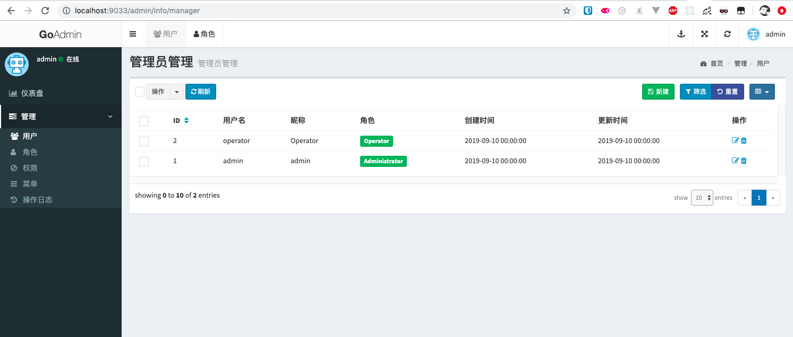
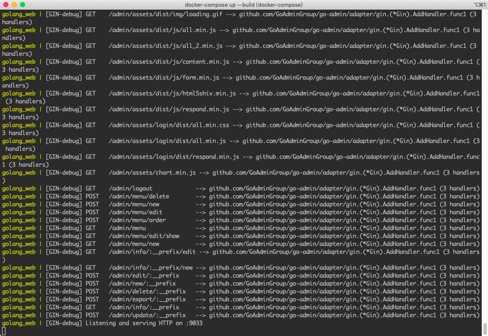

## 基于 go-admin 的demo

[go-admin](https://github.com/GoAdminGroup/go-admin)


## quick start
1. 使用 go1.14.1 执行的，go mod 包管理
2. 自己弄好数据库,配置在mysql/config.json里面
```bash

go run main.go
```

## docker 

```
# start
docker-compose up
http://localhost:9033/admin
admin/admin

```


